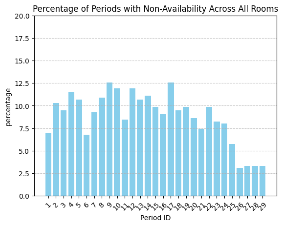

# Data overview

In this section, we detail the structure of the data converted into CSV. To understand this part correctly, please refer to the [data_convertion.md]() file first.

- Parameters
- Periods
- Rooms
- Exams
- Students
- Instructors
- Constraints

# Parameters
Values use inside the solver
| Property Name                                | Value       |
|---------------------------------------------|-------------|
| backToBackConflictWeight                    | 10.0        |
| backToBackDistance                          | -1.0        |
| directConflictWeight                        | 1000.0      |
| distanceBackToBackConflictWeight            | 25.0        |
| distanceToStronglyPreferredRoomWeight       | 1.0E-4      |
| distributionWeight                          | 1.0         |
| examRotationWeight                          | 1.0E-4      |
| instructorBackToBackConflictWeight          | 0.0         |
| instructorDirectConflictWeight              | 10.0        |
| instructorDistanceBackToBackConflictWeight  | 0.0         |
| instructorMoreThanTwoADayWeight             | 0.0         |
| isDayBreakBackToBack                        | false       |
| largePeriod                                 | 0.86        |
| largeSize                                   | 600         |
| largeWeight                                 | 2500000.0   |
| maxRooms                                    | 4           |
| moreThanTwoADayWeight                       | 100.0       |
| mpp                                         | false       |
| periodIndexWeight                           | 1.0E-7      |
| periodSizeWeight                            | 0.5         |
| periodWeight                                | 1.0         |
| perturbationWeight                          | 0.0010      |
| roomPerturbationWeight                      | 0.1         |
| roomSizeFactor                              | 1.1         |
| roomSizeWeight                              | 0.0010      |
| roomSplitDistanceWeight                     | 0.01        |
| roomSplitWeight                             | 10.0        |
| roomWeight                                  | 1.0         |

# Periods

| Column Name       | Data Type | Format|
|-------------------|-----------|-----|
| Period ID         | int64       ||
| Length (minutes)  | int64     ||
| Day               | string  |__%a %m/%d__    |
| Time              | string  |__%I:%M%p__    |
| Penalty           | int64      ||

- number of period : 29

<table border="1" class="dataframe">
  <thead>
    <tr style="text-align: right;">
      <th></th>
      <th>Period ID</th>
      <th>Length (minutes)</th>
      <th>Day</th>
      <th>Time</th>
      <th>Penalty</th>
    </tr>
  </thead>
  <tbody>
    <tr>
      <th>0</th>
      <td>1</td>
      <td>120</td>
      <td>Mon 12/10</td>
      <td>8:00AM - 10:00AM</td>
      <td>0</td>
    </tr>
    <tr>
      <th>1</th>
      <td>2</td>
      <td>120</td>
      <td>Mon 12/10</td>
      <td>10:30AM - 12:30PM</td>
      <td>0</td>
    </tr>
    <tr>
      <th>2</th>
      <td>3</td>
      <td>120</td>
      <td>Mon 12/10</td>
      <td>1:00PM - 3:00PM</td>
      <td>0</td>
    </tr>
    <tr>
      <th>3</th>
      <td>4</td>
      <td>120</td>
      <td>Mon 12/10</td>
      <td>3:30PM - 5:30PM</td>
      <td>0</td>
    </tr>
    <tr>
      <th>4</th>
      <td>5</td>
      <td>120</td>
      <td>Mon 12/10</td>
      <td>7:00PM - 9:00PM</td>
      <td>0</td>
    </tr>
  </tbody>
</table>

# Rooms
| Column Name   | Data Type | Format |
|---------------|-----------|--------|
| Room ID       | int64     ||
| Size          | int64     ||
| Alt Size      | int64     ||
| Coordinates   | string    | __float64,float64__|
| Period ID     | int64     ||
| Available     | bool      ||
| Penalty       | int64     ||

- row : 98695
- number of room : 486
- Size
    - Average : 60.9
    - min :  1
    - max : 6013
- Alternate size
    - Average : 33.6
    - min : 1
    - max : 2783

<table border="1" class="dataframe">
  <thead>
    <tr style="text-align: right;">
      <th></th>
      <th>Room ID</th>
      <th>Size</th>
      <th>Alt Size</th>
      <th>Coordinates</th>
      <th>Period ID</th>
      <th>Available</th>
      <th>Penalty</th>
    </tr>
  </thead>
  <tbody>
    <tr>
      <th>0</th>
      <td>1</td>
      <td>27</td>
      <td>14</td>
      <td>40.421707,-86.91657</td>
      <td>1</td>
      <td>True</td>
      <td>4</td>
    </tr>
    <tr>
      <th>1</th>
      <td>1</td>
      <td>27</td>
      <td>14</td>
      <td>40.421707,-86.91657</td>
      <td>2</td>
      <td>True</td>
      <td>4</td>
    </tr>
    <tr>
      <th>2</th>
      <td>1</td>
      <td>27</td>
      <td>14</td>
      <td>40.421707,-86.91657</td>
      <td>3</td>
      <td>True</td>
      <td>4</td>
    </tr>
    <tr>
      <th>3</th>
      <td>1</td>
      <td>27</td>
      <td>14</td>
      <td>40.421707,-86.91657</td>
      <td>4</td>
      <td>True</td>
      <td>4</td>
    </tr>
    <tr>
      <th>4</th>
      <td>1</td>
      <td>27</td>
      <td>14</td>
      <td>40.421707,-86.91657</td>
      <td>5</td>
      <td>True</td>
      <td>4</td>
    </tr>
  </tbody>
</table>

    

# Exams

| Column Name       | Data Type |
|-------------------|-----------|
| ExamID            | int64     |
| Length            | int64     |
| AltSeating        | bool      |
| MinSize           | int64     |
| MaxRooms          | int64     |
| Average           | int64     |
| PeriodID          | int64     |
| PeriodPenalty     | int64     |
| RoomID            | int64     |
| RoomPenalty       | int64     |
| AssignedPeriod    | float64   |
| AssignedRooms     | float64   |

- rows : 1864
- exams : 295

<table border="1" class="dataframe">
  <thead>
    <tr style="text-align: right;">
      <th></th>
      <th>ExamID</th>
      <th>Length</th>
      <th>AltSeating</th>
      <th>MinSize</th>
      <th>MaxRooms</th>
      <th>Average</th>
      <th>PeriodID</th>
      <th>PeriodPenalty</th>
      <th>RoomID</th>
      <th>RoomPenalty</th>
      <th>AssignedPeriod</th>
      <th>AssignedRooms</th>
    </tr>
  </thead>
  <tbody>
    <tr>
      <th>0</th>
      <td>1</td>
      <td>120</td>
      <td>False</td>
      <td>0</td>
      <td>4</td>
      <td>2</td>
      <td>1</td>
      <td>0</td>
      <td>107</td>
      <td>0</td>
      <td>NaN</td>
      <td>NaN</td>
    </tr>
    <tr>
      <th>1</th>
      <td>1</td>
      <td>120</td>
      <td>False</td>
      <td>0</td>
      <td>4</td>
      <td>2</td>
      <td>1</td>
      <td>0</td>
      <td>447</td>
      <td>0</td>
      <td>NaN</td>
      <td>NaN</td>
    </tr>
    <tr>
      <th>2</th>
      <td>1</td>
      <td>120</td>
      <td>False</td>
      <td>0</td>
      <td>4</td>
      <td>2</td>
      <td>1</td>
      <td>0</td>
      <td>477</td>
      <td>0</td>
      <td>NaN</td>
      <td>NaN</td>
    </tr>
    <tr>
      <th>3</th>
      <td>1</td>
      <td>120</td>
      <td>False</td>
      <td>0</td>
      <td>4</td>
      <td>2</td>
      <td>1</td>
      <td>0</td>
      <td>90</td>
      <td>0</td>
      <td>NaN</td>
      <td>NaN</td>
    </tr>
    <tr>
      <th>4</th>
      <td>1</td>
      <td>120</td>
      <td>False</td>
      <td>0</td>
      <td>4</td>
      <td>2</td>
      <td>1</td>
      <td>0</td>
      <td>94</td>
      <td>0</td>
      <td>NaN</td>
      <td>NaN</td>
    </tr>
  </tbody>
</table>

# Students
| Column Name | Data Type |
|-------------|-----------|
| Student ID  | int64     |
| Exam IDs    | int64     |

- Student number : 33279
- Average exam by student : 3.5
- Each student has at least one exam (maximum 8 for a given period)
- 75% of students have no more than 4 exams  

<table border="1" class="dataframe">
  <thead>
    <tr style="text-align: right;">
      <th></th>
      <th>Student ID</th>
      <th>Exam IDs</th>
    </tr>
  </thead>
  <tbody>
    <tr>
      <th>0</th>
      <td>1</td>
      <td>852</td>
    </tr>
    <tr>
      <th>1</th>
      <td>1</td>
      <td>1749</td>
    </tr>
    <tr>
      <th>2</th>
      <td>2</td>
      <td>845</td>
    </tr>
    <tr>
      <th>3</th>
      <td>3</td>
      <td>651</td>
    </tr>
    <tr>
      <th>4</th>
      <td>4</td>
      <td>1262</td>
    </tr>
  </tbody>
</table>

# Instructors

| Column Name          | Data Type | Format |
|----------------------|-----------|------|
| Instructor ID        | int64     ||
| Exam IDs             | int64     ||
| Unavailable Periods  | string   | int64,int64|

<table border="1" class="dataframe">
  <thead>
    <tr style="text-align: right;">
      <th></th>
      <th>Instructor ID</th>
      <th>Exam IDs</th>
      <th>Unavailable Periods</th>
    </tr>
  </thead>
  <tbody>
    <tr>
      <th>0</th>
      <td>1</td>
      <td>14</td>
      <td>NaN</td>
    </tr>
  </tbody>
</table>

# Constraints

| Column Name | Data Type | Format  |  
|------------|-----------|--------|
| Constraint Type | string         |  | 
|  Constraint ID  | int64         |  | 
| Hard             | bool         |  |
| Weight           | int64         |  | 
| Exam IDs           | string         | __int64,int64__ 

## Type of constraint
| Constraint Type   | count |
|---------------|-----------|
| different-period       | 17     |
| same-period          | 3     |
| different-room     | 0     |
| precedence   | 0    |

- row : 20
- number of contstraint : 20
  

<table border="1" class="dataframe">
  <thead>
    <tr style="text-align: right;">
      <th></th>
      <th>Constraint Type</th>
      <th>Constraint ID</th>
      <th>Hard</th>
      <th>Weight</th>
      <th>Exam IDs</th>
    </tr>
  </thead>
  <tbody>
    <tr>
      <th>0</th>
      <td>different-period</td>
      <td>1</td>
      <td>True</td>
      <td>0</td>
      <td>1411,601</td>
    </tr>
    <tr>
      <th>1</th>
      <td>different-period</td>
      <td>2</td>
      <td>True</td>
      <td>0</td>
      <td>709,1019</td>
    </tr>
    <tr>
      <th>2</th>
      <td>different-period</td>
      <td>3</td>
      <td>True</td>
      <td>0</td>
      <td>250,488</td>
    </tr>
    <tr>
      <th>3</th>
      <td>different-period</td>
      <td>4</td>
      <td>True</td>
      <td>0</td>
      <td>711,636</td>
    </tr>
    <tr>
      <th>4</th>
      <td>different-period</td>
      <td>5</td>
      <td>True</td>
      <td>0</td>
      <td>249,60</td>
    </tr>
  </tbody>
</table>

